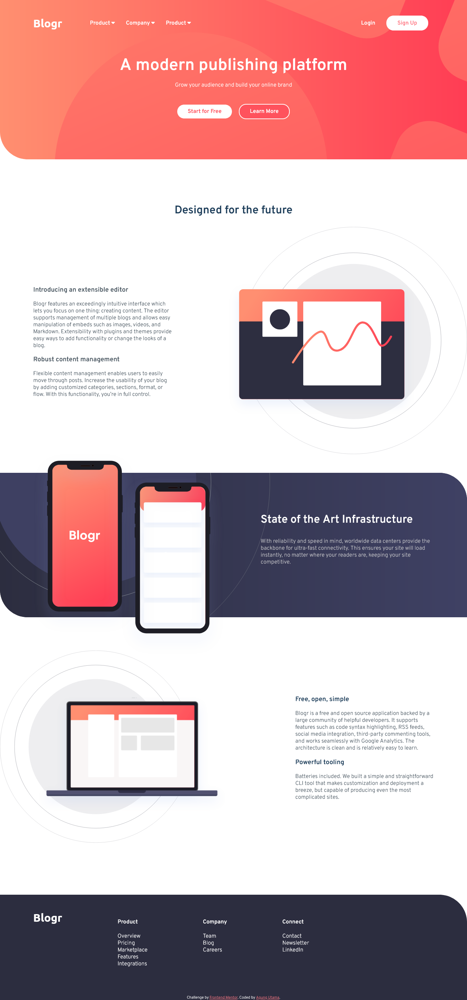

# Frontend Mentor - Blogr landing page solution

This is a solution to the [Blogr landing page challenge on Frontend Mentor](https://www.frontendmentor.io/challenges/blogr-landing-page-EX2RLAApP). Frontend Mentor challenges help you improve your coding skills by building realistic projects.

## Table of contents

- [Overview](#overview)
  - [The challenge](#the-challenge)
  - [Screenshot](#screenshot)
  - [Links](#links)
- [My process](#my-process)
  - [Built with](#built-with)
  - [Continued development](#continued-development)
  - [Useful resources](#useful-resources)
- [Author](#author)

## Overview

### The challenge

Users should be able to:

- View the optimal layout for the site depending on their device's screen size
- See hover states for all interactive elements on the page

### Screenshot

### Links

- Solution URL: [Add solution URL here](https://your-solution-url.com)
- Live Site URL: [netlify](https://blogr-landing-page-challeng-fem.netlify.app/)

## My process

### Built with

- Semantic HTML5 markup
- CSS custom properties
- Flexbox

### Continued development

This webiste is not responsive yet. So I will working on to adjust it to be more mobile-friendly.

### Useful resources

- [How to put gradient on image](https://webdevetc.com/blog/how-to-add-a-gradient-overlay-to-a-background-image-using-just-css-and-html/) - This helped me to put gradient on the background image.

- [CSS flexbox](https://css-tricks.com/snippets/css/a-guide-to-flexbox/) - To helped me remember

## Author

- Frontend Mentor - [@gnugautama](https://www.frontendmentor.io/profile/gnugautama)
- Twitter - [@gnugautama](https://www.twitter.com/@gnugautama)
